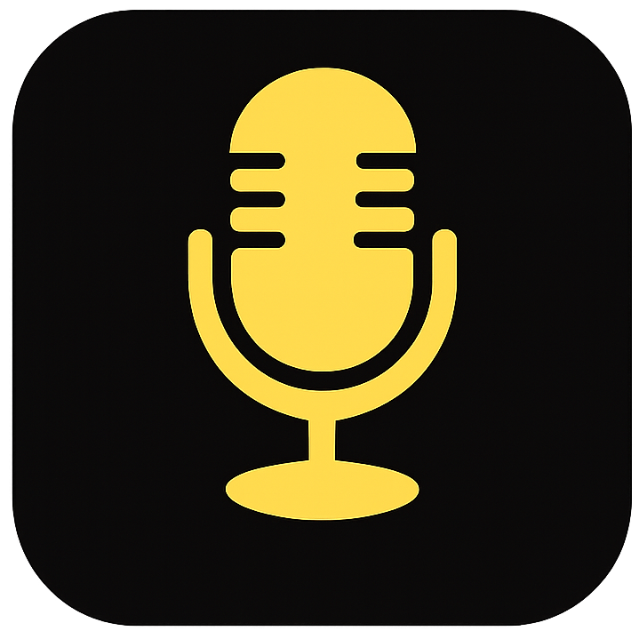

<p align="center">
  
</p>

<h1 align="center">VoiceWin</h1>

<p align="center">
  <strong>Native Windows Speech-to-Text Transcription App</strong><br>
  Press a key, speak, release — your words appear instantly.
</p>

<p align="center">
  <a href="https://github.com/safzanpirani/voicewin/releases">Download</a> •
  <a href="#quick-start">Quick Start</a> •
  <a href="#features">Features</a>
</p>

---

## Features

- **Hold Right Alt** to record, release to transcribe and paste
- **Tap Right Alt** to toggle recording (configurable)
- **Hybrid mode** — hold for quick recordings, tap to toggle for longer ones
- **Real-time Streaming** — see transcriptions appear as you speak (Deepgram)
- **AI Enhancement** — polish transcriptions with LLM-powered rewriting
- **Sound Feedback** — audio cues when recording starts/stops
- **Tray Icon Status** — visual indicator shows recording (red), processing (orange), or ready (green)
- Supports **Groq Whisper API** (fast, free tier available)
- Supports **Deepgram nova-3** (high quality, non-streaming or streaming)
- System tray app — runs in background
- Auto-paste transcribed text to focused window
- Single portable EXE — no installation required

## Requirements

- Windows 10/11 x64

## Quick Start

1. Download `VoiceWin.exe` from [Releases](https://github.com/safzanpirani/voicewin/releases)
2. Run it — no installation needed
3. Add your API key (Groq or Deepgram) in the settings window
4. Press **Right Alt** to record, release to transcribe

## API Keys

### Groq (Recommended — Fast & Free)
1. Go to [console.groq.com](https://console.groq.com)
2. Create an account and get an API key
3. Paste in the "Groq API Key" field

### Deepgram
1. Go to [console.deepgram.com](https://console.deepgram.com)
2. Create an account and get an API key
3. Paste in the "Deepgram API Key" field

## Usage

1. Press and hold **Right Alt** to start recording
2. Speak into your microphone
3. Release **Right Alt** to stop and transcribe
4. Text is automatically pasted into the focused text field

## Hotkey Modes

| Mode | Description |
|------|-------------|
| **Hold to Record** | Hold the key while speaking, release to transcribe |
| **Tap to Toggle** | Tap once to start, tap again to stop |
| **Hybrid** | Hold for quick recordings (≥250ms), or tap to toggle for longer sessions |

## Transcription Providers

### Non-Streaming (Groq, Deepgram)
Records audio, then transcribes after you stop. Fast and reliable.

### Streaming (Deepgram)
Transcribes in real-time as you speak — text appears immediately. Best used with **Toggle** hotkey mode.

> **Note:** There's a ~1 second delay while connecting to the Deepgram WebSocket. The sound plays once connected — wait for it before speaking.

> **Note:** Some apps (terminals, code editors) may strip trailing whitespace between transcript chunks. If words run together, try non-streaming mode or adjust your app's settings.

## AI Enhancement

Enable AI Enhancement to polish transcriptions with Groq's LLM:

- Fixes grammar, spelling, and punctuation
- Removes filler words and stutters
- Improves sentence structure and clarity
- Preserves your original meaning and tone

Customize the enhancement prompt in settings.

## Tray Icon Status

| Color | Status |
|-------|--------|
| 🟢 Green | Ready |
| 🔴 Red | Recording |
| 🟠 Orange | Processing |

## Settings

Settings are stored at:
```
%APPDATA%\VoiceWin\settings.json
```

## Build from Source

Requires [.NET 8.0 SDK](https://dotnet.microsoft.com/download/dotnet/8.0).

```bash
# Development build
dotnet restore
dotnet build src/VoiceWin -c Release

# Self-contained single-file EXE
dotnet publish src/VoiceWin -c Release -r win-x64 --self-contained true -p:PublishSingleFile=true -p:IncludeNativeLibrariesForSelfExtract=true
```

Output: `src/VoiceWin/bin/Release/net8.0-windows/win-x64/publish/VoiceWin.exe` (~156MB)

## License

MIT
